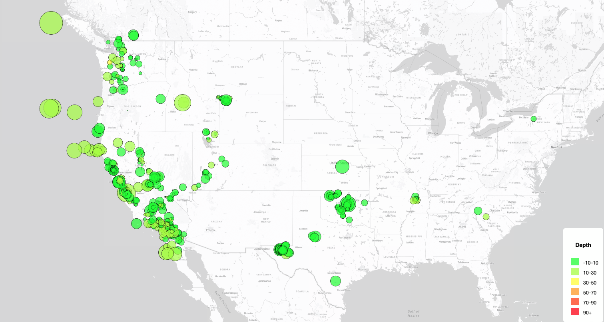
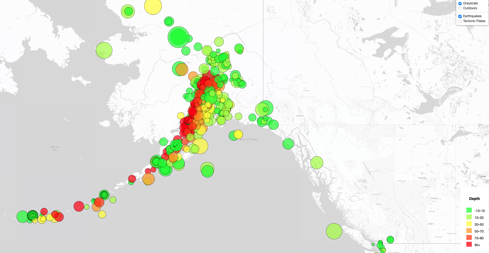
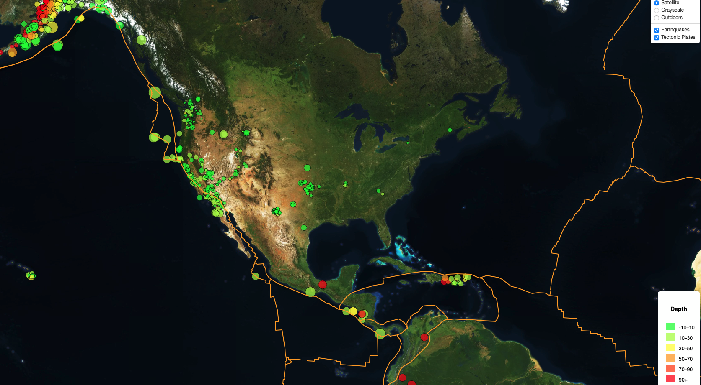
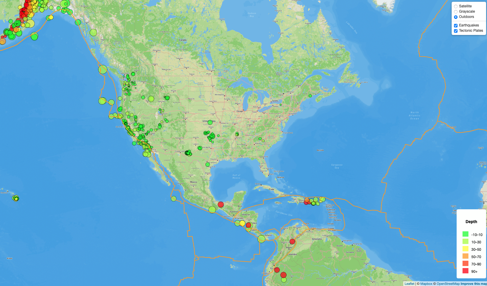

# UofT - Data Analysis Boot Camp

### Module 15 Mapping

### leaflet-challenge

### Background

Bootcamp Module 15 challenge Using Leaflet API , javaScript and D3 to plot geographical visualization of earthquake data available on the United States Geological Survey(USGS) website.

The United States Geological Survey provides real time data and information on earthquake observations around the world. This challenge provides a way to visualize USGS data that will allow them to better educate the public and other government organizations (and hopefully secure more funding) on issues facing our planet.

- Javascript

## Part 1 - Create the earthquake visualization

* Visualising the earthquakes around the world using the JSON data provided on the USGS website.
* The circular markers indicate the sites of earthquake occurences in the past seven days.
* The size of the markers indicate the magnitude of the earthquake. The bigger the marker, the higher the magnitude.
* The color of the markers indicate the depth of the earthquakes. The legend for the colors is available in the right hand bottom corner of the visual.
* Clicking on a marker displays the details of the earthquake which includes the location, the date and time, magnitude and the depth of the earthquake in a pop-up.

## Part 2 - Gathering more data to plot

* Adding a layer showing the tectonic plates on the map
* Layer toggling is possible by choosing the layer in the box situated in the upper right corner of the map.
* 

## References

* Dataset created by the [United States Geological Survey](https://earthquake.usgs.gov/earthquakes/feed/v1.0/geojson.php)
* Json dataset, gitHub -  [Tectonicplates, GeoJSON data](https://raw.githubusercontent.com/fraxen/tectonicplates/refs/heads/master/GeoJSON/PB2002_boundaries.json)
* [D3.js](https://d3js.org/)
* [Leaflet](https://leafletjs.com/)
* [chroma.js](https://gka.github.io/chroma.js/) (for gradient)
